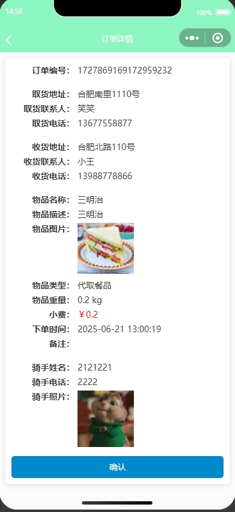
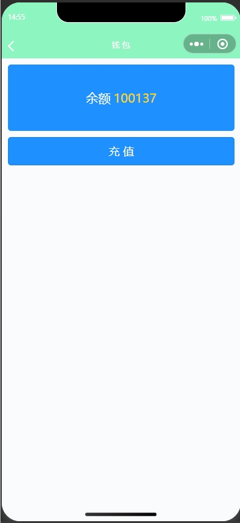

# 校园跑腿小程序，外卖跑腿小程序
## 1、项目功能描述
### 管理员角色：
- 登录、订单管理、联系人管理、认证信息管理、收支信息管理、评价管理、公告管理、管理员管理、用户管理、个人中心、修改密码
### 商家角色：
- 注册、登录、接单（需提交认证骑手）、查看骑手订单
### 用户角色：
- 注册、登录
- 首页：查看公告、分类下单
- 下单页：设置取货地址、收货地址、设置订单信息、提交订单
- 订单页：查看订单、取消订单、确认收货、评价订单、删除订单
- 我的：头像、姓名、（骑手信息）、我的地址管理、收支明细查看、
- 我的评价管理、我的钱包、充值、个人信息管理、平台介绍、用户协议、退出登录
## 2、项目技术栈
后端：Springboot2 + Mybatis + Redis
前端：Vue2 + ElementUI
小程序端：uni-app 支持小程序端
数据库： MySQL
模式：前后端分离
##  3、运行效果
### 小程序端运行效果
- 小程序首页，下单
  
--
- 查看订单，跑腿费用，订单详情
  
----------
- 收支明细、我的余额
  
----------
- 充值、骑手订单

-----------
- 骑手认证，个人资料

-----------
- 地址管理，
  

- 登录注册

### 后台管理
-首页

- 订单管理

- 地址管理

- 骑手认证管理

- 收支明细

- 用户评论

- 公告信息评论

- 管理员信息和用户管理

### 版本要求：
jdk1.8，MySQL 5.7或者8，node.js环境16版本，maven版本建议3.8及以上，navicat建议不低于16
## 4、项目创新点
uniapp小程序 + web多端设计 多角色设计
设计定时任务自动取消过期订单
使用Redis缓存评论信息
